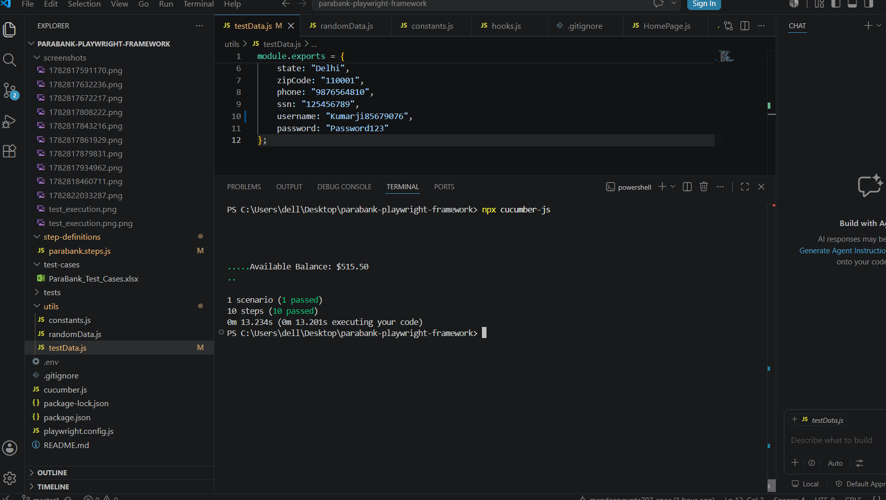

# ParaBank Automation Framework

## Overview

This project is an end-to-end test automation framework developed using **Playwright**, **JavaScript**, and **Cucumber (BDD)**. It automates the complete user journey on the ParaBank application, including user registration, login, verification of the Accounts Overview page, and printing the available account balance.

## Tech Stack

- Playwright
- JavaScript
- Cucumber (BDD)
- Node.js

## Framework Design

The framework follows the **Page Object Model (POM)** design pattern for better maintainability and reusability.

### Features

- Page Object Model (POM)
- Cucumber BDD
- Dynamic test data generation
- Environment variable support
- Reusable Base Page
- Screenshot capture on test failure
- Manual test cases included

## Project Structure

```
parabank-playwright-framework
│
├── features/
│   └── parabank.feature
│
├── hooks/
│   └── hooks.js
│
├── pages/
│   ├── BasePage.js
│   ├── HomePage.js
│   ├── RegisterPage.js
│   ├── LoginPage.js
│   └── AccountsOverviewPage.js
│
├── step-definitions/
│   └── parabank.steps.js
│
├── utils/
│   ├── constants.js
│   ├── randomData.js
│   └── testData.js
│
├── screenshots/
│   └── test_execution.png
│
├── ParaBank_Test_Cases.xlsx
├── package.json
├── package-lock.json
├── README.md
└── .gitignore
```

## Test Scenario

The automated test performs the following steps:

1. Launch the ParaBank application.
2. Navigate to the registration page.
3. Register a new user with dynamically generated credentials.
4. Verify successful registration.
5. Log out from the application.
6. Log in using the newly registered credentials.
7. Verify the Accounts Overview page.
8. Print the available account balance in the console.

## Installation

Clone the repository:

```bash
git clone https://github.com/mandeepgupta707-spec/playwright-parabank-framework.git
```

Install dependencies:

```bash
npm install
```

## Execute Tests

```bash
npx cucumber-js
```

## Sample Output

```
1 scenario (1 passed)
10 steps (10 passed)

Available Balance: $5150.50
```

## Test Execution Screenshot



## Manual Test Cases

Manual test cases are provided in:

```
ParaBank_Test_Cases.xlsx
```

## Author

**Mandeep Gupta**

QA Automation Engineer